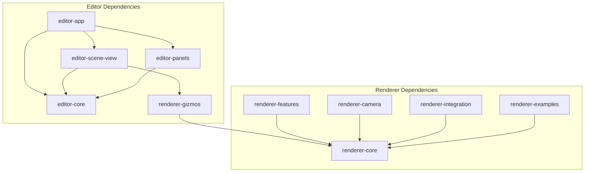

# Phase 19: Large Crate Breakdown Technical Details

## Detailed File Analysis

### engine-editor-egui Structure (7,328 lines)

#### Scene View Subsystem (2,319 lines - 31.6%)
```
panels/scene_view/
├── gizmo_3d_input.rs       465 lines  # Input handling for 3D gizmos
├── object_renderer.rs      361 lines  # Object rendering logic
├── navigation.rs           342 lines  # Scene navigation controls
├── navigation_tests.rs     321 lines  # TEST FILE
├── scene_view_impl.rs      299 lines  # Main scene view implementation
├── mod.rs                  262 lines  # Module coordination
├── rendering.rs            247 lines  # Rendering pipeline
├── camera_movement_tests.rs 223 lines  # TEST FILE
├── improved_grid.rs        172 lines  # Grid rendering
├── ecs_camera_bridge.rs    155 lines  # Camera-ECS integration
├── debug_overlay.rs        140 lines  # Debug visualization
└── camera_movement.rs       53 lines  # Camera controls
```

#### Core Editor Files (1,023 lines)
```
├── main.rs                 475 lines  # Entry point (needs splitting)
├── world_setup.rs          249 lines  # World initialization
├── editor_state.rs         212 lines  # Editor state management
├── editor_coordinator.rs    65 lines  # Component coordination
├── utils.rs                 19 lines  # Utilities
└── bridge/                  13 lines  # Bridge utilities
```

#### Panel System (1,260 lines)
```
panels/
├── inspector.rs            546 lines  # Property inspector (large!)
├── hierarchy.rs            434 lines  # Scene hierarchy
├── game_view.rs             68 lines  # Game viewport
├── console.rs               64 lines  # Debug console
└── project.rs               52 lines  # Project browser
```

### engine-renderer-3d Structure (6,976 lines)

#### Core Rendering (2,016 lines)
```
├── renderer.rs             802 lines  # NEEDS BREAKDOWN
├── culling.rs              430 lines  # Frustum culling
├── render_queue.rs         424 lines  # Render command queue
├── resources.rs            317 lines  # Resource management
└── material.rs              48 lines  # Basic materials
```

#### Examples (2,263 lines - 32.4%)
```
examples/
├── various test files     2,263 lines  # SHOULD NOT BE IN MAIN CRATE
```

#### Feature Systems
```
├── gizmo_3d.rs             725 lines  # 3D gizmo rendering
├── camera_advanced.rs      498 lines  # Advanced camera controller
├── grid.rs                 357 lines  # Grid rendering
├── texture.rs              276 lines  # Texture management
├── camera.rs               117 lines  # Basic camera
└── mesh.rs                  71 lines  # Mesh handling
```

## Dependency Analysis

### Current Dependencies

#### engine-editor-egui imports:
```rust
// External
eframe = "0.24"
egui = "0.24"
egui_dock = "0.8"

// Internal - would need to be split
engine-ecs-core = { path = "../core/engine-ecs-core" }
engine-components-3d = { path = "../core/engine-components-3d" }
engine-renderer-3d = { path = "../implementation/engine-renderer-3d" }
// ... many more
```

#### engine-renderer-3d imports:
```rust
// External
wgpu = "0.20"
winit = "0.29"
bytemuck = "1.14"

// Internal
engine-ecs-core = { path = "../../core/engine-ecs-core" }
engine-components-3d = { path = "../../core/engine-components-3d" }
```

### Proposed Dependency Structure



## Interface Design

### Scene View Interface
```rust
// In engine-editor-core
pub trait SceneViewPanel: Send + Sync {
    fn show(
        &mut self,
        ui: &mut egui::Ui,
        world: &mut World,
        selected_entity: Option<Entity>,
        scene_navigation: &mut SceneNavigation,
    ) -> Vec<ConsoleMessage>;
    
    fn handle_shortcuts(&mut self, input: &egui::InputState);
    fn get_camera_state(&self) -> &CameraState;
}

// In engine-editor-scene-view
pub struct SceneView {
    navigation: SceneNavigation,
    gizmo_input: Gizmo3DInput,
    // ... other fields
}

impl SceneViewPanel for SceneView {
    // Implementation
}
```

### Renderer Module Interfaces
```rust
// In engine-renderer-core
pub trait RenderFeature: Send + Sync {
    fn prepare(&mut self, world: &World, resources: &RenderResources);
    fn render<'a>(&'a self, render_pass: &mut RenderPass<'a>);
}

// In engine-renderer-gizmos
pub struct GizmoRenderer {
    pipeline: RenderPipeline,
    meshes: GizmoMeshes,
}

impl RenderFeature for GizmoRenderer {
    // Implementation
}
```

## Migration Strategy Details

### Step 1: Module Preparation
Before splitting, reorganize within existing crates:

```rust
// Current: everything in root
// engine-editor-egui/src/panels/scene_view/mod.rs

// Prepare: group by feature
// engine-editor-egui/src/panels/scene_view/
pub mod navigation {
    pub use super::navigation::*;
    pub use super::camera_movement::*;
}

pub mod rendering {
    pub use super::rendering::*;
    pub use super::object_renderer::*;
    pub use super::improved_grid::*;
}

pub mod input {
    pub use super::gizmo_3d_input::*;
}
```

### Step 2: Extract with Minimal Changes
```bash
# 1. Create new crate
cargo new --lib crates/application/engine-editor-scene-view

# 2. Move files preserving structure
mv crates/application/engine-editor-egui/src/panels/scene_view/* \
   crates/application/engine-editor-scene-view/src/

# 3. Update Cargo.toml to include same dependencies
# 4. Add facade in original location for compatibility
```

### Step 3: Update Integration Points
```rust
// Before: Direct module use
use crate::panels::scene_view::SceneViewPanel;

// After: External crate
use engine_editor_scene_view::SceneViewPanel;
```

## File Size Breakdown Strategy

### Breaking Down renderer.rs (802 lines)
```
Current structure analysis:
- Pipeline creation: ~200 lines
- Frame rendering: ~250 lines  
- Resource binding: ~150 lines
- State management: ~200 lines

Proposed split:
renderer/
├── mod.rs          # Public API (~50 lines)
├── pipeline.rs     # Pipeline creation (~200 lines)
├── frame.rs        # Frame rendering (~250 lines)
├── resources.rs    # Resource binding (~150 lines)
└── state.rs        # State management (~200 lines)
```

### Breaking Down inspector.rs (546 lines)
```
Current structure:
- Component property editors: ~200 lines
- Transform UI: ~150 lines
- Material/Light UI: ~100 lines
- Utility functions: ~96 lines

Proposed split:
inspector/
├── mod.rs              # Coordination (~50 lines)
├── properties.rs       # Generic property editors (~150 lines)
├── transform_ui.rs     # Transform editing (~150 lines)
├── component_ui.rs     # Component-specific UI (~150 lines)
└── utils.rs           # Utilities (~46 lines)
```

## Performance Considerations

### Crate Boundary Overhead
- Function calls across crates cannot be inlined without LTO
- Solution: Enable LTO for release builds
- Use `#[inline]` for hot-path functions

### Compilation Parallelism
```toml
# In workspace Cargo.toml
[profile.dev]
split-debuginfo = "unpacked"  # Faster linking on macOS
incremental = true

[profile.dev.package."*"]
opt-level = 0  # Faster compilation

[profile.release]
lto = "thin"  # Balance between optimization and build time
```

## Testing Strategy

### Integration Tests for Split Crates
```rust
// tests/scene_view_integration.rs
#[test]
fn test_scene_view_renders() {
    let mut app = create_test_app();
    let scene_view = engine_editor_scene_view::SceneView::new();
    
    // Verify scene view can be created and used
    assert!(scene_view.is_valid());
}
```

### Benchmark Before/After
```rust
// benches/compile_time.rs
// Measure incremental compilation time
fn benchmark_incremental_build() {
    // 1. Make small change to scene view
    // 2. Measure rebuild time
    // 3. Compare before/after split
}
```