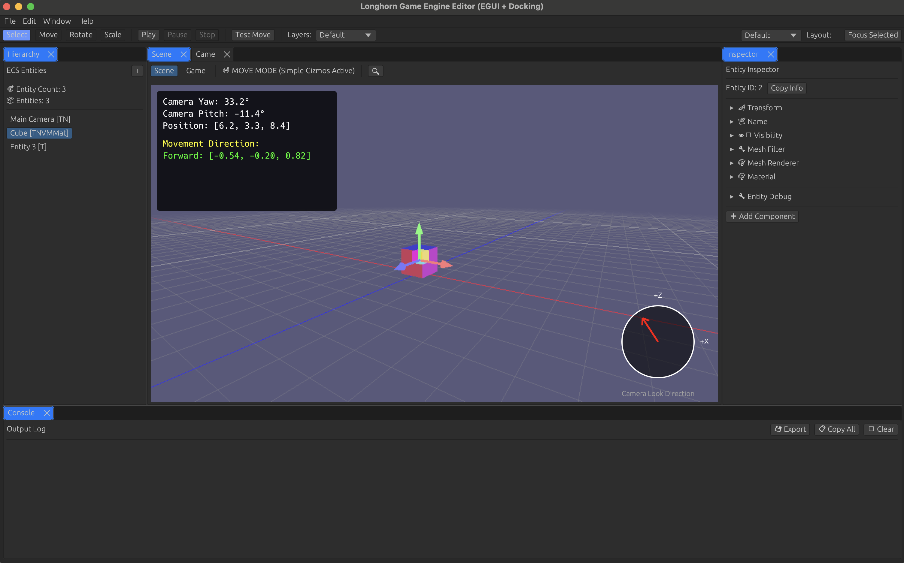

# Longhorn Game Engine

A modular, high-performance game engine written in Rust with a professional game editor.



## 🏗️ Architecture

Longhorn is built with a clean, modular architecture using Rust workspaces, organized into core systems, implementations, and applications:

### Core Systems
- **`engine-ecs-core`** - High-performance Entity Component System
- **`engine-math-core`** - Math utilities and transformations
- **`engine-renderer-core`** - Rendering abstractions and interfaces
- **`engine-geometry-core`** - Geometry and mesh definitions
- **`engine-physics-core`** - Physics system interfaces
- **`engine-audio-core`** - Audio system abstractions
- **`engine-resource-core`** - Resource management and loading
- **`engine-camera-core`** - Camera system and projections
- **`engine-events-core`** - Event system for inter-component communication
- **`engine-materials-core`** - Material and shader abstractions
- **`engine-component-traits`** - Common component interfaces
- **`engine-components-3d`** - 3D game components (Transform, MeshRenderer, etc.)
- **`engine-components-2d`** - 2D game components
- **`engine-components-ui`** - UI components

### Implementation Layer
- **`engine-renderer-3d`** - WGPU-based 3D renderer implementation
- **`engine-geometry-impl`** - Geometry processing and generation
- **`engine-camera-impl`** - Camera implementations
- **`engine-mesh-import`** - 3D model importers (OBJ, FBX, GLTF)
- **`engine-texture-import`** - Texture importing and processing
- **`engine-audio-import`** - Audio file importers
- **`engine-asset-import`** - General asset import pipeline

### Applications & Tools
- **`engine-editor-egui`** - Main editor application using egui
- **`engine-editor-scene-view`** - 3D scene viewport with gizmos
- **`engine-editor-panels`** - Editor panels (Hierarchy, Inspector, etc.)
- **`engine-editor-ui`** - Editor UI components and styling
- **`engine-editor-framework`** - Editor framework and architecture
- **`engine-editor-assets`** - Asset management for editor

## 🚀 Quick Start

### Running the Editor
```bash
cargo run --bin longhorn-editor
```

### Building All Crates
```bash
cargo build --workspace
```

### Running Tests
```bash
cargo test --workspace
```

### Running with optimizations
```bash
cargo run --bin longhorn-editor --release
```

## 🎯 Features

### Editor Features
- **Professional Interface**: Modern game editor with dockable panels
- **Scene View**: Interactive 3D viewport with manipulation gizmos
- **Hierarchy Panel**: Scene object management with drag & drop
- **Inspector Panel**: Component-based object editing
- **Project View**: Asset browser with folder navigation
- **Console Panel**: Logging and debugging output
- **Game View**: Play mode preview
- **Asset Import**: Support for 3D models (OBJ, FBX, GLTF), textures, and audio

### Engine Features
- **Modern Rendering**: WGPU-based renderer with PBR support
- **Entity Component System**: High-performance ECS architecture
- **Component System**: Flexible component-based game objects
- **3D Gizmos**: Transform manipulation tools in editor
- **Asset Pipeline**: Efficient asset loading and management
- **Modular Architecture**: Clean separation of concerns

## 📱 Platform Support

- **Desktop**: Windows, macOS, Linux
- **Graphics**: Vulkan, Metal, DX12, OpenGL (via WGPU)
- **Mobile**: iOS, Android (planned)
- **Web**: WebAssembly (planned)

## 📁 Project Structure

```
longhorn-game-engine/
├── crates/
│   ├── core/                  # Core engine systems
│   │   ├── engine-ecs-core/   # Entity Component System
│   │   ├── engine-math-core/  # Math utilities
│   │   └── ...
│   │
│   ├── implementation/        # System implementations
│   │   ├── engine-renderer-3d/ # WGPU renderer
│   │   ├── engine-camera-impl/ # Camera systems
│   │   └── ...
│   │
│   ├── application/           # Applications
│   │   ├── engine-editor-egui/ # Main editor
│   │   ├── engine-editor-panels/
│   │   └── ...
│   │
│   └── integration/           # Integration tests
│
├── assets/                    # Engine assets
├── docs/                      # Documentation
│   └── project/              # Project documentation
│       └── phases/           # Development phases
│
└── examples/                  # Example projects
```

## 🛠️ Development

### Prerequisites
- Rust 1.70+
- Platform-specific graphics drivers

### Development Commands

```bash
# Run the editor
cargo run --bin longhorn-editor

# Run with logging
RUST_LOG=debug cargo run --bin longhorn-editor

# Run benchmarks
cargo bench

# Check code without building
cargo check --workspace

# Format code
cargo fmt --all

# Run clippy lints
cargo clippy --workspace
```

### Creating a New Component

Components are defined in the appropriate components crate:
- 3D components: `crates/core/engine-components-3d`
- 2D components: `crates/core/engine-components-2d`
- UI components: `crates/core/engine-components-ui`

Example component:
```rust
#[derive(Debug, Clone, Component)]
pub struct Health {
    pub current: f32,
    pub max: f32,
}
```

## 📚 Documentation

- [Project Phases](docs/project/phases/) - Development roadmap and completed features
- API Documentation: Run `cargo doc --open`

## 🤝 Contributing

Contributions are welcome! Please read our contributing guidelines before submitting PRs.

## 📄 License

MIT OR Apache-2.0